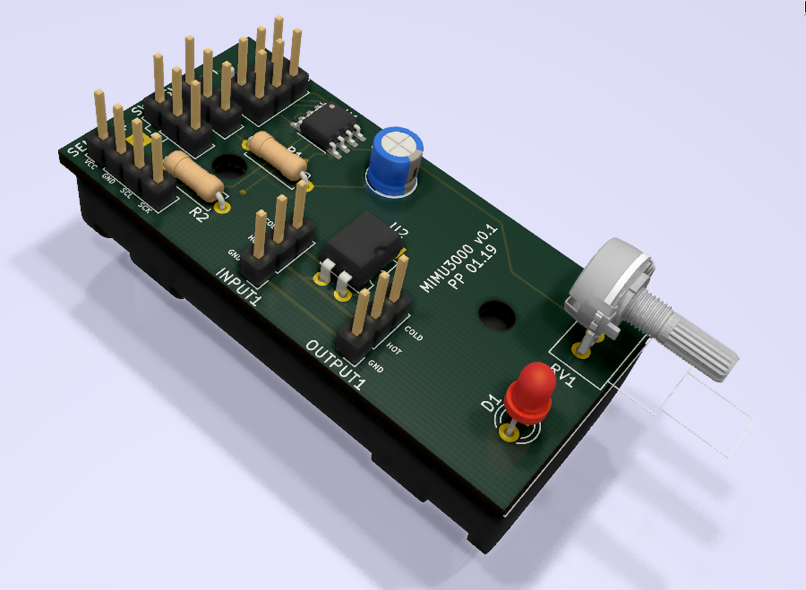

# Microphone Mute
Range Sensor for auto-muting a microphone when not in use

## Description
On stage, noise level is high. A gate on the mics is sometimes not sufficient.
This device is intended to be mounted directly on the back of the mic, sensor facing towards mic.
The trigger-distance is adjustable with the potentiometer.

Two Variants exist: Battery powered (see top image), and an experimental phantom powered version:

## BOM
Main Features:
- ATtiny88 Processor
- GY-530 IR TOF Distance Sensor (VL53L0X)
- AQY211EHAX DIP4 Optocoupler
For complete list, see [bom](pcb/mimu3000.csv)
