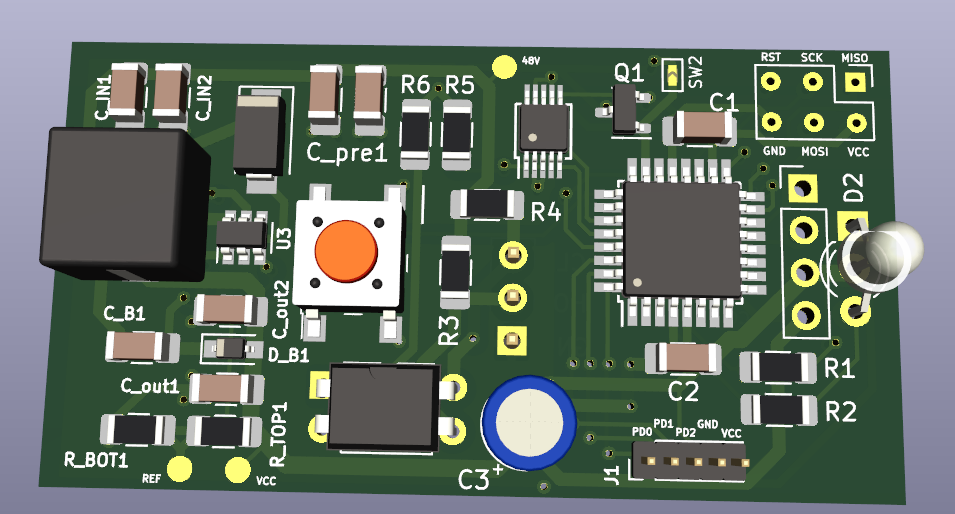

# Microphone Mute
Range Sensor for auto-muting a microphone when not in use.

## Description
On stage, noise level is high. A gate on the mics is sometimes not sufficient.
This device is intended to be mounted directly on the back of the mic, sensor facing towards mic.
The trigger-distance is adjustable by pressing the top button.
Also, by double-pressing this button, different mute-profiles will be selectable where choices can be the on- or the off-ramp time, and the dampening (gate/expander) in "mute" mode (testing required).

## BOM
Main Features:
- ATtiny88 Processor
- GY-530 IR TOF Distance Sensor (VL53L0X)
- PC817 Optocoupler as an attenuator
- AD5258 digi-potentiometer as a variable current control for the Opto

For complete list, see [BOM](pcb/mimu_phantom_bom.html)

